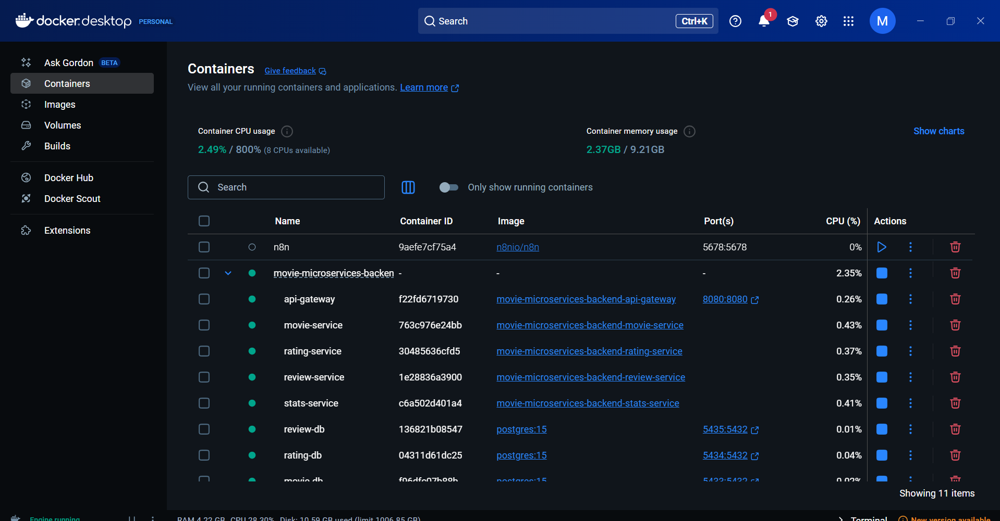
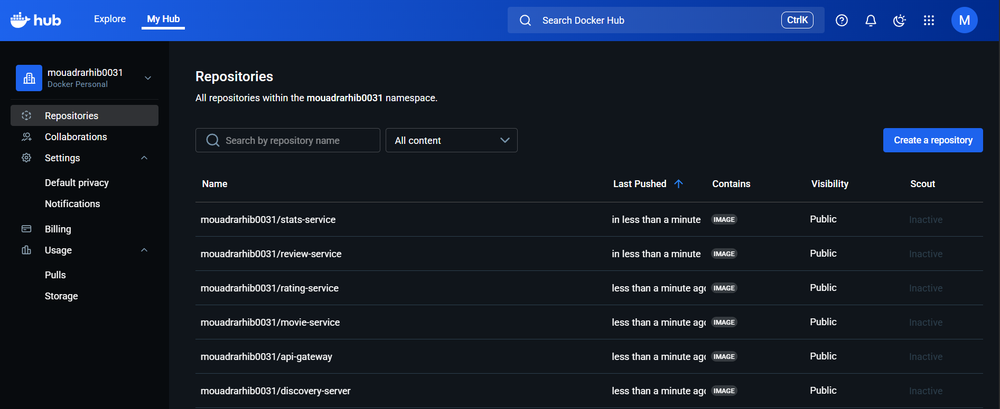
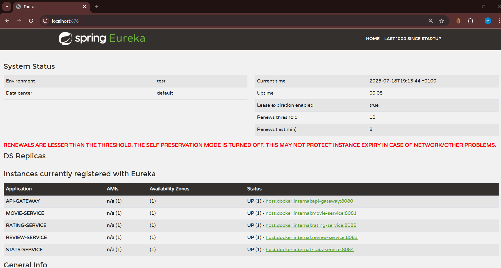
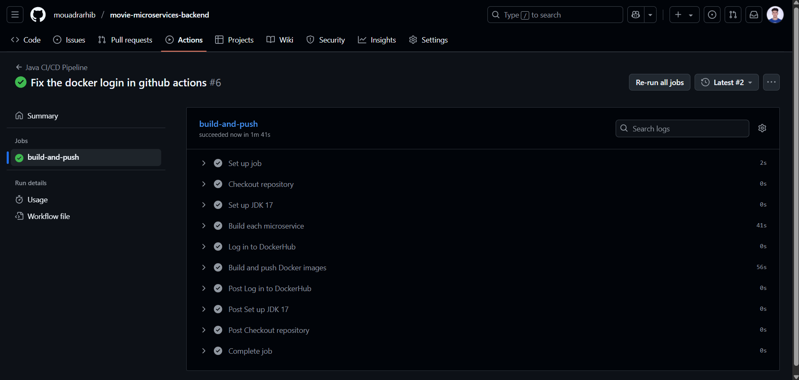
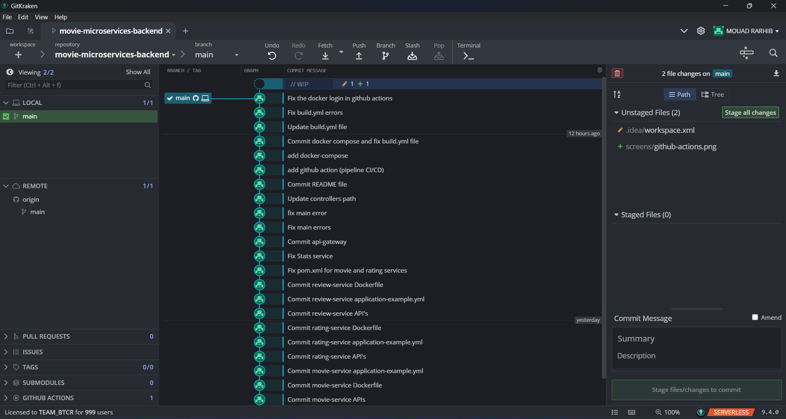
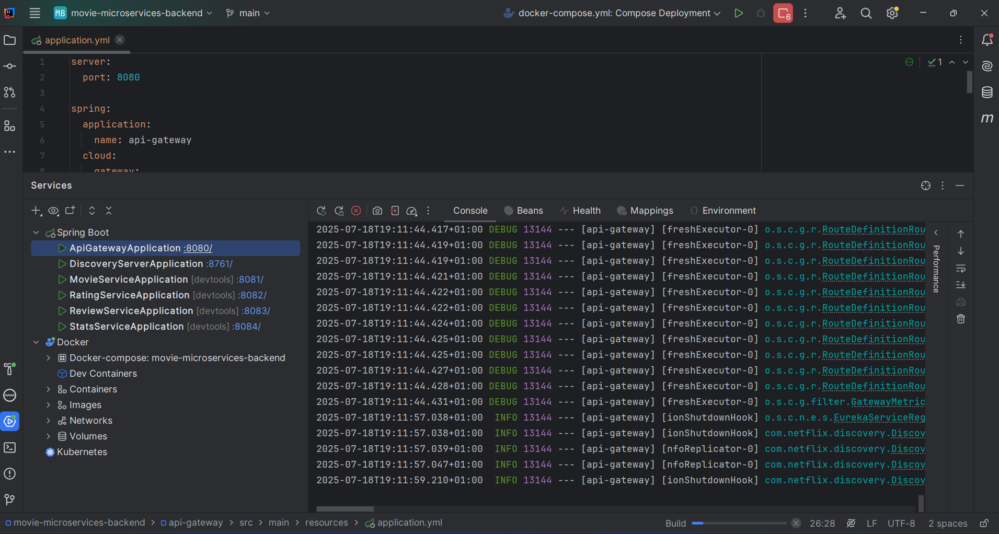
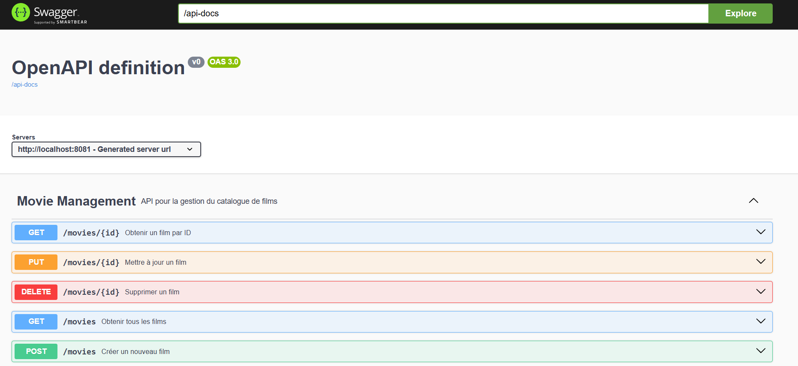

# 🎬 Movie Microservices Platform

A movie catalog platform built using a microservices architecture with Spring Boot, Spring Cloud, and PostgreSQL.

## 🏗️ Architecture

The project consists of 6 microservices: :

- **discovery-server** (Port 8761) - Eureka Discovery Server
- **api-gateway** (Port 8080) - API Gateway (Spring Cloud Gateway)
- **movie-service** (Port 8081) - Movie catalog management
- **rating-service** (Port 8082) -Rating management (1–5 stars)
- **review-service** (Port 8083) -  Anonymous review management
- **stats-service** (Port 8084) - Statistics aggregation

## 🚀 Fonctionnalités

### Movie Service
- Full CRUD for movies (title, genre, release year, description)
- Search by title, genre, or release year
- Filtering and pagination
- REST API with Swagger documentation

### Rating Service
- 1–5 star rating system
- One rating per user session per movie
- Average rating calculation
- Rating distribution

### Review Service
- Anonymous reviews with optional name
- One review per user session per movie
- Searchable reviews
- Content validation (10–1000 characters)

### Stats Service
- Aggregates data using Feign clients
- Complete movie statistics (average, number of ratings/reviews)
- Inter-service communication

## 🛠️ Technologies

### Visual Overview









- **Backend**: Spring Boot 3.2.0, Spring Cloud 2023.0.0
- **Base de données**: PostgreSQL 15
- **Service Discovery**: Netflix Eureka
- **API Gateway**: Spring Cloud Gateway
- **Communication**: OpenFeign
- **Documentation**: SpringDoc OpenAPI (Swagger)
- **Conteneurisation**: Docker & Docker Compose
- **CI/CD**: GitHub Actions
- **Build**: Maven

## 📦 Project Structure

```
movie-microservices/
├── discovery-server/          # Serveur Eureka
├── api-gateway/              # Passerelle API
├── movie-service/            # Service de films
├── rating-service/           # Service de notes
├── review-service/           # Service de commentaires
├── stats-service/            # Service de statistiques
├── .github/workflows/        # Pipeline CI/CD
├── docker-compose.yml        # Orchestration Docker
├── init-db.sql              # Script d'initialisation DB
└── README.md                 # Documentation
```

## 🚀 Quick Start

### Prerequisites
- Java 17+
- Maven 3.6+
- Docker & Docker Compose
- PostgreSQL (si exécution locale)

### Option 1: With Docker Compose (Recommended)

1. **Clone the project**
```bash
git clone <repository-url>
cd movie-microservices
```

2. **Build all services**
```bash
mvn clean package -DskipTests
```

3. **Start with Docker Compose**
```bash
docker-compose up -d
```

4. **Verify deployment**
- Eureka Dashboard: http://localhost:8761
- API Gateway: http://localhost:8080
- Swagger UI for services: http://localhost:808X/swagger-ui.html

### Option 2: Run Locally (Manual)

1. **Start PostgreSQL**
```bash
# Create the databases
createdb movie_db
createdb rating_db
createdb review_db
```

2. **Start services in order**
```bash
# 1. Discovery Server
cd discovery-server && mvn spring-boot:run

# 2. API Gateway
cd api-gateway && mvn spring-boot:run

# 3. Business services (can be parallel)
cd movie-service && mvn spring-boot:run
cd rating-service && mvn spring-boot:run
cd review-service && mvn spring-boot:run
cd stats-service && mvn spring-boot:run
```

## 📚 API Documentation

### Main Endpoints via API Gateway (http://localhost:8080)

#### Movies
- `GET /api/movies` -  Paginated list of movies
- `POST /api/movies` -  Create a movie
- `GET /api/movies/{id}` - Get movie details
- `PUT /api/movies/{id}` - Update a movie
- `DELETE /api/movies/{id}` -  Delete a movie
- `GET /api/movies/search?title=&genre=&releaseYear=` - Search movies

#### Ratings
- `POST /api/ratings` -  Add or update a rating
- `GET /api/ratings/movie/{movieId}` - Get ratings for a movie
- `GET /api/ratings/movie/{movieId}/average` - Average rating
- `GET /api/ratings/movie/{movieId}/count` - Number of ratings

#### Reviews
- `POST /api/reviews` - Add or update a review
- `GET /api/reviews/movie/{movieId}` -  Get reviews for a movie
- `GET /api/reviews/movie/{movieId}/count` - Number of reviews

#### Stats
- `GET /api/stats/movie/{movieId}` - Complete movie statistics

### Swagger Docs
Each service exposes its own Swagger UI:
- Movie Service: http://localhost:8081/swagger-ui.html
- Rating Service: http://localhost:8082/swagger-ui.html
- Review Service: http://localhost:8083/swagger-ui.html
- Stats Service: http://localhost:8084/swagger-ui.html

## 🧪 Tests

### Run Unit Tests
```bash
# All services
mvn test

#  Specific service
cd movie-service && mvn test
```

### Integration Tests
```bash
# Start test environment
docker-compose -f docker-compose.test.yml up -d

#  Run integration tests
mvn verify
```

## 🔧 Configuration

### Docker Environment Variables
- `SPRING_DATASOURCE_URL` - Database URL
- `SPRING_DATASOURCE_USERNAME` -  DB username
- `SPRING_DATASOURCE_PASSWORD` - DB password
- `EUREKA_CLIENT_SERVICE_URL_DEFAULTZONE` - URL Eureka

### Spring Profiles
- `dev` - Local development
- `docker` - Docker containers
- `prod` - Production

## 🚀 Deployment

### CI/CD with GitHub Actions
The automated pipeline performs:
1. **Test** -  Unit testing for each service
2. **Build** - Maven packaging
3. **Docker** - Build Docker images on the main branch

### Production Deployment
```bash
# Build for production
mvn clean package -Pprod

# Deploy using Docker Compose
docker-compose -f docker-compose.prod.yml up -d
```

## 📊 Monitoring

### Health Checks
- Discovery Server: http://localhost:8761/actuator/health
- API Gateway: http://localhost:8080/actuator/health
- Services: http://localhost:808X/actuator/health

### Metrics
Each service exposes metrics via Spring Boot Actuator.

## 🤝 Contribution

1. Fork the project
2. Create a feature branch (git checkout -b feature/new-feature)
3. Commit your changes (git commit -am 'Add new feature')
4. Push to the branch (git push origin feature/new-feature)
5. Open a Pull Request

## 📝 Licence

This project is licensed under the MIT License. See the LICENSE file for details.

## 🆘 Support

If you have questions or issues:
1. Check the Swagger documentation
2. Look into the service logs
3. Open a GitHub issue

## 🔮 Roadmap

- [ ] JWT authentication
- [ ]  Movie image uploads
- [ ] Recommendation systems
- [ ] Redis caching
- [ ] Monitoring with Prometheus/Grafana
- [ ] End-to-end tests using Testcontainers

